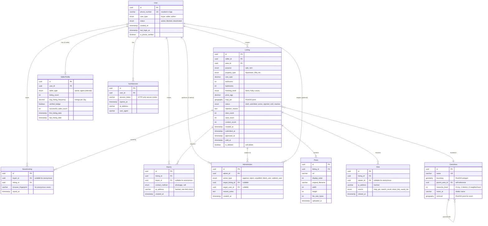

# Data Model Documentation: Makaan MVP

**Database**: PostgreSQL 16 + PostGIS 3.6
**ORM**: TypeORM (NestJS integration)
**Created**: 2026-02-22
**Status**: MVP Design

## Table of Contents

1. [Entity Relationship Diagram](#entity-relationship-diagram)
2. [Enum Types](#enum-types)
3. [Table Schemas](#table-schemas)
4. [Indexes Strategy](#indexes-strategy)
5. [Spatial Queries](#spatial-queries)
6. [TypeORM Entity Examples](#typeorm-entity-examples)
7. [Database Migrations Strategy](#database-migrations-strategy)
8. [Performance Considerations](#performance-considerations)
9. [Security & Privacy](#security--privacy)

---

## Entity Relationship Diagram



---

## Enum Types

PostgreSQL enum types ensure data integrity and query performance.

```sql
-- User types
CREATE TYPE user_type_enum AS ENUM ('buyer', 'seller', 'admin');

-- User account status
CREATE TYPE user_status_enum AS ENUM ('active', 'blocked', 'deactivated');

-- Seller classification (inferred from behavior)
CREATE TYPE seller_type_enum AS ENUM ('owner', 'agent');

-- Listing purpose
CREATE TYPE listing_purpose_enum AS ENUM ('sale', 'rent');

-- Property types (FR-005)
CREATE TYPE property_type_enum AS ENUM (
    'Apartment',
    'Villa',
    'Duplex',
    'Penthouse',
    'Studio',
    'Townhouse',
    'Chalet'
);

-- Finishing levels (FR-013)
CREATE TYPE finishing_level_enum AS ENUM (
    'Semi-finished',
    'Fully finished',
    'Luxury finished'
);

-- Listing status workflow
CREATE TYPE listing_status_enum AS ENUM (
    'draft',      -- Seller saved but not submitted
    'submitted',  -- Awaiting admin review
    'active',     -- Approved and visible to buyers
    'rejected',   -- Admin rejected with reason
    'sold',       -- Seller marked as sold
    'inactive'    -- Seller marked as inactive
);

-- View source tracking
CREATE TYPE view_source_enum AS ENUM (
    'map_pin',
    'search_result',
    'direct_link',
    'saved_list'
);

-- Contact methods
CREATE TYPE contact_method_enum AS ENUM ('whatsapp', 'call');

-- Admin action types
CREATE TYPE admin_action_type_enum AS ENUM (
    'approve_listing',
    'reject_listing',
    'unpublish_listing',
    'block_user',
    'unblock_user',
    'delete_listing'
);
```

---

## Table Schemas

### 1. User Table

Core user entity for buyers, sellers, and admins.

```sql
CREATE TABLE "user" (
    id UUID PRIMARY KEY DEFAULT gen_random_uuid(),

    -- Authentication & Identity
    phone_number VARCHAR(20) NOT NULL UNIQUE,
    phone_country_code VARCHAR(5) NOT NULL DEFAULT '+20', -- Egypt
    is_phone_verified BOOLEAN NOT NULL DEFAULT FALSE,

    -- User Classification
    user_type user_type_enum NOT NULL DEFAULT 'buyer',
    status user_status_enum NOT NULL DEFAULT 'active',

    -- Admin-specific fields
    password_hash VARCHAR(255), -- Only for admin users
    two_factor_secret VARCHAR(255), -- Only for admin users
    is_2fa_enabled BOOLEAN NOT NULL DEFAULT FALSE,

    -- Timestamps
    created_at TIMESTAMP WITH TIME ZONE NOT NULL DEFAULT CURRENT_TIMESTAMP,
    last_login_at TIMESTAMP WITH TIME ZONE,
    updated_at TIMESTAMP WITH TIME ZONE NOT NULL DEFAULT CURRENT_TIMESTAMP,

    -- Soft delete (FR-047: GDPR compliance)
    deleted_at TIMESTAMP WITH TIME ZONE,

    -- Constraints
    CONSTRAINT user_phone_format CHECK (phone_number ~ '^\+?[1-9]\d{1,14}$'),
    CONSTRAINT admin_requires_password CHECK (
        user_type != 'admin' OR password_hash IS NOT NULL
    ),
    CONSTRAINT admin_requires_2fa CHECK (
        user_type != 'admin' OR is_2fa_enabled = TRUE
    )
);

-- Indexes
CREATE INDEX idx_user_phone ON "user"(phone_number) WHERE deleted_at IS NULL;
CREATE INDEX idx_user_type_status ON "user"(user_type, status) WHERE deleted_at IS NULL;
CREATE INDEX idx_user_created_at ON "user"(created_at DESC);

COMMENT ON TABLE "user" IS 'Core user table for buyers, sellers, and admins';
COMMENT ON COLUMN "user".phone_number IS 'Primary identifier - masked in logs (FR-045)';
COMMENT ON COLUMN "user".password_hash IS 'Bcrypt hash - admin only (FR-023: min 12 chars)';
COMMENT ON COLUMN "user".two_factor_secret IS 'TOTP secret for 2FA - admin only (FR-023)';
```

### 2. Seller Profile Table

Extended profile for sellers with inferred classification.

```sql
CREATE TABLE seller_profile (
    id UUID PRIMARY KEY DEFAULT gen_random_uuid(),
    user_id UUID NOT NULL UNIQUE REFERENCES "user"(id) ON DELETE CASCADE,

    -- Seller Classification (FR-022: inferred from behavior)
    seller_type seller_type_enum NOT NULL DEFAULT 'owner',

    -- Activity Metrics
    listing_count INT NOT NULL DEFAULT 0,
    active_listing_count INT NOT NULL DEFAULT 0,
    successful_sales_count INT NOT NULL DEFAULT 0,

    -- Frequency Tracking (for seller type inference)
    first_listing_date TIMESTAMP WITH TIME ZONE,
    last_listing_date TIMESTAMP WITH TIME ZONE,
    avg_listing_frequency DECIMAL(5,2), -- Listings per day

    -- Verification Badge
    verified_badge BOOLEAN NOT NULL DEFAULT FALSE,
    verified_at TIMESTAMP WITH TIME ZONE,

    -- Timestamps
    created_at TIMESTAMP WITH TIME ZONE NOT NULL DEFAULT CURRENT_TIMESTAMP,
    updated_at TIMESTAMP WITH TIME ZONE NOT NULL DEFAULT CURRENT_TIMESTAMP,

    -- Constraints
    CONSTRAINT listing_counts_valid CHECK (
        listing_count >= active_listing_count AND
        listing_count >= successful_sales_count
    )
);

-- Indexes
CREATE INDEX idx_seller_user_id ON seller_profile(user_id);
CREATE INDEX idx_seller_type_verified ON seller_profile(seller_type, verified_badge);
CREATE INDEX idx_seller_listing_frequency ON seller_profile(avg_listing_frequency DESC);

COMMENT ON TABLE seller_profile IS 'Extended seller data with inferred owner/agent classification';
COMMENT ON COLUMN seller_profile.seller_type IS 'Inferred from listing count, frequency, phone reuse (FR-022)';
COMMENT ON COLUMN seller_profile.avg_listing_frequency IS 'Used for rate limiting: 5/day owner, 20/day agent (FR-021)';
```

### 3. Auth Session Table

Session management for authentication (FR-041).

```sql
CREATE TABLE auth_session (
    id UUID PRIMARY KEY DEFAULT gen_random_uuid(),
    user_id UUID NOT NULL REFERENCES "user"(id) ON DELETE CASCADE,

    -- Session Data
    session_token VARCHAR(255) NOT NULL UNIQUE, -- Stored in HTTP-only cookie
    refresh_token VARCHAR(255), -- For token rotation

    -- Expiration
    expires_at TIMESTAMP WITH TIME ZONE NOT NULL,

    -- Security Tracking
    ip_address INET,
    user_agent TEXT,

    -- Timestamps
    created_at TIMESTAMP WITH TIME ZONE NOT NULL DEFAULT CURRENT_TIMESTAMP,
    last_activity_at TIMESTAMP WITH TIME ZONE NOT NULL DEFAULT CURRENT_TIMESTAMP,

    -- Constraints
    CONSTRAINT session_not_expired CHECK (expires_at > created_at)
);

-- Indexes
CREATE INDEX idx_session_token ON auth_session(session_token);
CREATE INDEX idx_session_user_id ON auth_session(user_id);
CREATE INDEX idx_session_expires ON auth_session(expires_at) WHERE expires_at > CURRENT_TIMESTAMP;

-- Auto-cleanup expired sessions
CREATE INDEX idx_session_cleanup ON auth_session(expires_at) WHERE expires_at <= CURRENT_TIMESTAMP;

COMMENT ON TABLE auth_session IS 'Session tracking for authenticated users (FR-041)';
COMMENT ON COLUMN auth_session.session_token IS 'Stored in HTTP-only secure cookie';
```

### 4. OTP Verification Table

Temporary OTP storage with TTL (FR-011, FR-012).

```sql
CREATE TABLE otp_verification (
    id UUID PRIMARY KEY DEFAULT gen_random_uuid(),

    -- Target
    phone_number VARCHAR(20) NOT NULL,

    -- OTP Data (NEVER logged - FR-046)
    otp_code VARCHAR(6) NOT NULL, -- 6-digit code

    -- Rate Limiting (FR-012: 3 attempts per 10 minutes)
    attempt_count INT NOT NULL DEFAULT 0,

    -- Expiration (FR-011: 5 minutes)
    expires_at TIMESTAMP WITH TIME ZONE NOT NULL,

    -- Verification Status
    is_verified BOOLEAN NOT NULL DEFAULT FALSE,
    verified_at TIMESTAMP WITH TIME ZONE,

    -- Security
    ip_address INET NOT NULL,

    -- Timestamps
    created_at TIMESTAMP WITH TIME ZONE NOT NULL DEFAULT CURRENT_TIMESTAMP
);

-- Indexes
CREATE INDEX idx_otp_phone ON otp_verification(phone_number, created_at DESC);
CREATE INDEX idx_otp_expires ON otp_verification(expires_at);

-- Auto-cleanup expired OTPs (TTL)
CREATE INDEX idx_otp_cleanup ON otp_verification(created_at)
WHERE is_verified = FALSE AND expires_at <= CURRENT_TIMESTAMP;

COMMENT ON TABLE otp_verification IS 'Temporary OTP storage with 5-min TTL (FR-011, FR-012)';
COMMENT ON COLUMN otp_verification.otp_code IS 'NEVER logged or exposed in APIs (FR-046)';
```

### 5. Listing Table

Core property listing entity with spatial data.

```sql
CREATE TABLE listing (
    id UUID PRIMARY KEY DEFAULT gen_random_uuid(),

    -- Ownership
    seller_id UUID NOT NULL REFERENCES "user"(id) ON DELETE CASCADE,
    area_id UUID REFERENCES cairo_area(id) ON DELETE SET NULL,

    -- Required Fields (FR-013)
    purpose listing_purpose_enum NOT NULL,
    property_type property_type_enum NOT NULL,
    size_sqm DECIMAL(10,2) NOT NULL,
    bedrooms INT NOT NULL,
    bathrooms INT NOT NULL,
    finishing_level finishing_level_enum NOT NULL,
    price_egp DECIMAL(12,2) NOT NULL, -- Egyptian Pounds

    -- Spatial Data (PostGIS)
    map_pin GEOGRAPHY(POINT, 4326) NOT NULL, -- WGS 84

    -- Optional Fields
    description TEXT,
    floor_number INT,
    total_floors INT,
    has_parking BOOLEAN DEFAULT FALSE,
    has_elevator BOOLEAN DEFAULT FALSE,

    -- Status Workflow
    status listing_status_enum NOT NULL DEFAULT 'draft',
    rejection_reason TEXT,

    -- Engagement Metrics
    view_count INT NOT NULL DEFAULT 0,
    save_count INT NOT NULL DEFAULT 0,
    contact_count INT NOT NULL DEFAULT 0,

    -- Timestamps
    created_at TIMESTAMP WITH TIME ZONE NOT NULL DEFAULT CURRENT_TIMESTAMP,
    updated_at TIMESTAMP WITH TIME ZONE NOT NULL DEFAULT CURRENT_TIMESTAMP,
    submitted_at TIMESTAMP WITH TIME ZONE,
    approved_at TIMESTAMP WITH TIME ZONE,
    rejected_at TIMESTAMP WITH TIME ZONE,
    sold_at TIMESTAMP WITH TIME ZONE,

    -- Soft Delete (FR-047)
    is_deleted BOOLEAN NOT NULL DEFAULT FALSE,
    deleted_at TIMESTAMP WITH TIME ZONE,

    -- Constraints
    CONSTRAINT listing_price_positive CHECK (price_egp > 0),
    CONSTRAINT listing_size_positive CHECK (size_sqm > 0),
    CONSTRAINT listing_bedrooms_valid CHECK (bedrooms >= 0 AND bedrooms <= 20),
    CONSTRAINT listing_bathrooms_valid CHECK (bathrooms >= 0 AND bathrooms <= 20),
    CONSTRAINT listing_floor_valid CHECK (
        floor_number IS NULL OR
        (floor_number >= -2 AND floor_number <= total_floors)
    ),
    CONSTRAINT listing_rejection_requires_reason CHECK (
        status != 'rejected' OR rejection_reason IS NOT NULL
    ),
    CONSTRAINT listing_submitted_timestamp CHECK (
        status = 'draft' OR submitted_at IS NOT NULL
    ),
    CONSTRAINT listing_approved_timestamp CHECK (
        status != 'active' OR approved_at IS NOT NULL
    )
);

-- Indexes
CREATE INDEX idx_listing_seller ON listing(seller_id) WHERE is_deleted = FALSE;
CREATE INDEX idx_listing_area ON listing(area_id) WHERE is_deleted = FALSE;
CREATE INDEX idx_listing_status ON listing(status) WHERE is_deleted = FALSE;
CREATE INDEX idx_listing_purpose_type ON listing(purpose, property_type) WHERE is_deleted = FALSE;
CREATE INDEX idx_listing_price ON listing(price_egp) WHERE is_deleted = FALSE AND status = 'active';
CREATE INDEX idx_listing_bedrooms ON listing(bedrooms) WHERE is_deleted = FALSE AND status = 'active';
CREATE INDEX idx_listing_created_at ON listing(created_at DESC);

-- Composite indexes for common filter combinations
CREATE INDEX idx_listing_filters ON listing(purpose, property_type, status, price_egp, bedrooms)
WHERE is_deleted = FALSE;

-- Spatial index (GiST) for map queries (FR-001, FR-014, FR-026)
CREATE INDEX idx_listing_map_pin ON listing USING GIST(map_pin)
WHERE is_deleted = FALSE AND status = 'active';

-- Full-text search index for descriptions (future enhancement)
CREATE INDEX idx_listing_description_fts ON listing USING GIN(to_tsvector('arabic', description))
WHERE is_deleted = FALSE;

COMMENT ON TABLE listing IS 'Property listings with PostGIS spatial data';
COMMENT ON COLUMN listing.map_pin IS 'PostGIS geography point - must be within Cairo (FR-014)';
COMMENT ON COLUMN listing.price_egp IS 'Price in Egyptian Pounds - always EGP for MVP';
COMMENT ON INDEX idx_listing_map_pin IS 'GiST spatial index for map queries and duplicate detection (FR-026)';
```

### 6. Photo Table

Listing images with metadata.

```sql
CREATE TABLE photo (
    id UUID PRIMARY KEY DEFAULT gen_random_uuid(),
    listing_id UUID NOT NULL REFERENCES listing(id) ON DELETE CASCADE,

    -- Image Data
    url VARCHAR(500) NOT NULL, -- CDN URL
    display_order INT NOT NULL DEFAULT 0,

    -- Metadata
    original_filename VARCHAR(255),
    width INT NOT NULL,
    height INT NOT NULL,
    file_size_bytes INT NOT NULL,
    format VARCHAR(10) NOT NULL, -- jpg, png, webp

    -- Processing Status
    is_processed BOOLEAN NOT NULL DEFAULT FALSE,
    is_exif_stripped BOOLEAN NOT NULL DEFAULT FALSE, -- FR-017

    -- Timestamps
    uploaded_at TIMESTAMP WITH TIME ZONE NOT NULL DEFAULT CURRENT_TIMESTAMP,

    -- Constraints
    CONSTRAINT photo_format_valid CHECK (format IN ('jpg', 'jpeg', 'png', 'webp')),
    CONSTRAINT photo_file_size_valid CHECK (file_size_bytes <= 5242880), -- 5MB (FR-016)
    CONSTRAINT photo_dimensions_valid CHECK (width > 0 AND height > 0)
);

-- Indexes
CREATE INDEX idx_photo_listing ON photo(listing_id, display_order);
CREATE INDEX idx_photo_uploaded ON photo(uploaded_at DESC);

COMMENT ON TABLE photo IS 'Listing photos with EXIF stripped (FR-017) and server-side compression (FR-018)';
COMMENT ON COLUMN photo.url IS 'CDN URL - photos resized/compressed server-side (FR-018)';
```

### 7. Cairo Area Table

Geographic boundaries for area-based search.

```sql
CREATE TABLE cairo_area (
    id UUID PRIMARY KEY DEFAULT gen_random_uuid(),

    -- Area Identity
    name VARCHAR(100) NOT NULL UNIQUE,
    name_ar VARCHAR(100) NOT NULL, -- Arabic name

    -- Spatial Data (PostGIS)
    boundary GEOMETRY(POLYGON, 4326) NOT NULL, -- Area boundary
    centroid GEOGRAPHY(POINT, 4326) NOT NULL, -- For map centering

    -- Hierarchy (FR-004: resolve to geographic boundaries)
    parent_area_id UUID REFERENCES cairo_area(id) ON DELETE SET NULL,
    hierarchy_level INT NOT NULL DEFAULT 0, -- 0=city, 1=district, 2=neighborhood

    -- Metadata
    population_estimate INT,
    area_sqkm DECIMAL(10,2),

    -- Timestamps
    created_at TIMESTAMP WITH TIME ZONE NOT NULL DEFAULT CURRENT_TIMESTAMP,
    updated_at TIMESTAMP WITH TIME ZONE NOT NULL DEFAULT CURRENT_TIMESTAMP,

    -- Constraints
    CONSTRAINT area_hierarchy_valid CHECK (hierarchy_level >= 0 AND hierarchy_level <= 2),
    CONSTRAINT area_no_self_parent CHECK (parent_area_id != id)
);

-- Indexes
CREATE INDEX idx_area_name ON cairo_area(name);
CREATE INDEX idx_area_name_ar ON cairo_area(name_ar);
CREATE INDEX idx_area_parent ON cairo_area(parent_area_id);
CREATE INDEX idx_area_hierarchy ON cairo_area(hierarchy_level);

-- Spatial indexes for boundary queries
CREATE INDEX idx_area_boundary ON cairo_area USING GIST(boundary);
CREATE INDEX idx_area_centroid ON cairo_area USING GIST(centroid);

-- Full-text search for autocomplete (FR-002)
CREATE INDEX idx_area_name_trgm ON cairo_area USING GIN(name gin_trgm_ops);
CREATE INDEX idx_area_name_ar_trgm ON cairo_area USING GIN(name_ar gin_trgm_ops);

COMMENT ON TABLE cairo_area IS 'Named geographic areas in Cairo with PostGIS boundaries (FR-004)';
COMMENT ON COLUMN cairo_area.boundary IS 'PostGIS polygon for area-based filtering';
COMMENT ON COLUMN cairo_area.centroid IS 'PostGIS point for map zoom centering';
```

### 8. Saved Listing Table

Buyer's saved properties (FR-032 - FR-035).

```sql
CREATE TABLE saved_listing (
    id UUID PRIMARY KEY DEFAULT gen_random_uuid(),

    -- References
    buyer_id UUID REFERENCES "user"(id) ON DELETE CASCADE, -- Nullable for anonymous
    listing_id UUID NOT NULL REFERENCES listing(id) ON DELETE CASCADE,

    -- Anonymous Tracking (FR-033: browser storage)
    browser_fingerprint VARCHAR(255), -- For unauthenticated users

    -- Timestamps
    saved_at TIMESTAMP WITH TIME ZONE NOT NULL DEFAULT CURRENT_TIMESTAMP,

    -- Constraints
    CONSTRAINT saved_listing_has_identifier CHECK (
        buyer_id IS NOT NULL OR browser_fingerprint IS NOT NULL
    )
);

-- Indexes
CREATE INDEX idx_saved_buyer ON saved_listing(buyer_id, saved_at DESC);
CREATE INDEX idx_saved_listing ON saved_listing(listing_id);
CREATE INDEX idx_saved_fingerprint ON saved_listing(browser_fingerprint, saved_at DESC);

-- Unique constraint: one save per buyer per listing
CREATE UNIQUE INDEX idx_saved_unique_user ON saved_listing(buyer_id, listing_id)
WHERE buyer_id IS NOT NULL;

CREATE UNIQUE INDEX idx_saved_unique_anon ON saved_listing(browser_fingerprint, listing_id)
WHERE browser_fingerprint IS NOT NULL;

COMMENT ON TABLE saved_listing IS 'Buyer saved listings - supports anonymous via browser storage (FR-033)';
```

### 9. View Table

Listing view tracking for analytics.

```sql
CREATE TABLE view (
    id UUID PRIMARY KEY DEFAULT gen_random_uuid(),

    -- References
    listing_id UUID NOT NULL REFERENCES listing(id) ON DELETE CASCADE,
    viewer_id UUID REFERENCES "user"(id) ON DELETE SET NULL, -- Nullable for anonymous

    -- Tracking
    ip_address VARCHAR(64) NOT NULL, -- Hashed for privacy (FR-045)
    source view_source_enum NOT NULL,
    user_agent TEXT,

    -- Timestamps
    viewed_at TIMESTAMP WITH TIME ZONE NOT NULL DEFAULT CURRENT_TIMESTAMP
);

-- Indexes
CREATE INDEX idx_view_listing ON view(listing_id, viewed_at DESC);
CREATE INDEX idx_view_viewer ON view(viewer_id, viewed_at DESC);
CREATE INDEX idx_view_source ON view(source);
CREATE INDEX idx_view_date ON view(viewed_at DESC);

-- Partitioning preparation (for scalability)
CREATE INDEX idx_view_listing_date ON view(listing_id, viewed_at DESC);

COMMENT ON TABLE view IS 'Listing view events for analytics (FR-037)';
COMMENT ON COLUMN view.ip_address IS 'Hashed IP for privacy - not raw IP (FR-045)';
```

### 10. Inquiry Table

Buyer contact actions (WhatsApp/call).

```sql
CREATE TABLE inquiry (
    id UUID PRIMARY KEY DEFAULT gen_random_uuid(),

    -- References
    listing_id UUID NOT NULL REFERENCES listing(id) ON DELETE CASCADE,
    buyer_id UUID REFERENCES "user"(id) ON DELETE SET NULL, -- Nullable for anonymous

    -- Contact Details
    contact_method contact_method_enum NOT NULL,

    -- Rate Limiting (FR-044: 50/day per buyer)
    ip_address VARCHAR(64) NOT NULL, -- Hashed

    -- Timestamps
    created_at TIMESTAMP WITH TIME ZONE NOT NULL DEFAULT CURRENT_TIMESTAMP
);

-- Indexes
CREATE INDEX idx_inquiry_listing ON inquiry(listing_id, created_at DESC);
CREATE INDEX idx_inquiry_buyer ON inquiry(buyer_id, created_at DESC);
CREATE INDEX idx_inquiry_ip_date ON inquiry(ip_address, created_at DESC); -- Rate limit check

COMMENT ON TABLE inquiry IS 'Buyer contact actions - rate limited 50/day (FR-044)';
COMMENT ON COLUMN inquiry.ip_address IS 'Hashed IP for rate limiting without storing raw IP';
```

### 11. Admin Action Table

Audit log for admin moderation (FR-031).

```sql
CREATE TABLE admin_action (
    id UUID PRIMARY KEY DEFAULT gen_random_uuid(),

    -- Actor
    admin_id UUID NOT NULL REFERENCES "user"(id) ON DELETE CASCADE,

    -- Action
    action_type admin_action_type_enum NOT NULL,

    -- Target (one must be set)
    target_listing_id UUID REFERENCES listing(id) ON DELETE SET NULL,
    target_user_id UUID REFERENCES "user"(id) ON DELETE SET NULL,

    -- Details
    reason_notes TEXT,

    -- Metadata
    ip_address INET,

    -- Timestamps
    created_at TIMESTAMP WITH TIME ZONE NOT NULL DEFAULT CURRENT_TIMESTAMP,

    -- Constraints
    CONSTRAINT admin_action_has_target CHECK (
        target_listing_id IS NOT NULL OR target_user_id IS NOT NULL
    )
);

-- Indexes
CREATE INDEX idx_admin_action_admin ON admin_action(admin_id, created_at DESC);
CREATE INDEX idx_admin_action_listing ON admin_action(target_listing_id, created_at DESC);
CREATE INDEX idx_admin_action_user ON admin_action(target_user_id, created_at DESC);
CREATE INDEX idx_admin_action_type ON admin_action(action_type);
CREATE INDEX idx_admin_action_date ON admin_action(created_at DESC);

COMMENT ON TABLE admin_action IS 'Audit log for all admin actions (FR-031)';
COMMENT ON COLUMN admin_action.reason_notes IS 'Required for rejections (FR-028)';
```

---

## Indexes Strategy

### Primary Indexes (Already Defined)

All tables have primary keys (UUID) and appropriate foreign key indexes.

### Spatial Indexes (PostGIS)

```sql
-- Listing map pins (FR-001, FR-014)
CREATE INDEX idx_listing_map_pin ON listing USING GIST(map_pin)
WHERE is_deleted = FALSE AND status = 'active';

-- Area boundaries (FR-004)
CREATE INDEX idx_area_boundary ON cairo_area USING GIST(boundary);
CREATE INDEX idx_area_centroid ON cairo_area USING GIST(centroid);
```

### Composite Indexes (Query Optimization)

```sql
-- Common filter combinations (FR-005, FR-006)
CREATE INDEX idx_listing_filters ON listing(
    purpose, property_type, status, price_egp, bedrooms
) WHERE is_deleted = FALSE;

-- Seller dashboard queries (FR-036)
CREATE INDEX idx_listing_seller_status ON listing(seller_id, status, created_at DESC)
WHERE is_deleted = FALSE;

-- Admin moderation queue (FR-024)
CREATE INDEX idx_listing_pending_queue ON listing(submitted_at ASC)
WHERE status = 'submitted' AND is_deleted = FALSE;
```

### Full-Text Search Indexes

```sql
-- Enable pg_trgm extension for autocomplete
CREATE EXTENSION IF NOT EXISTS pg_trgm;

-- Area name autocomplete (FR-002)
CREATE INDEX idx_area_name_trgm ON cairo_area USING GIN(name gin_trgm_ops);
CREATE INDEX idx_area_name_ar_trgm ON cairo_area USING GIN(name_ar gin_trgm_ops);

-- Listing description search (future)
CREATE INDEX idx_listing_description_fts ON listing
USING GIN(to_tsvector('arabic', description))
WHERE is_deleted = FALSE;
```

### Partial Indexes (Performance)

```sql
-- Active listings only (most queries)
CREATE INDEX idx_listing_active_only ON listing(created_at DESC)
WHERE status = 'active' AND is_deleted = FALSE;

-- Expired sessions cleanup
CREATE INDEX idx_session_cleanup ON auth_session(expires_at)
WHERE expires_at <= CURRENT_TIMESTAMP;

-- Expired OTPs cleanup
CREATE INDEX idx_otp_cleanup ON otp_verification(created_at)
WHERE is_verified = FALSE AND expires_at <= CURRENT_TIMESTAMP;
```

---

## Spatial Queries

### 1. Find Listings Within Cairo Boundaries (FR-014)

```sql
-- Validate map pin is within any Cairo area
SELECT EXISTS (
    SELECT 1
    FROM cairo_area
    WHERE ST_Contains(boundary, ST_GeomFromText('POINT(31.2357 30.0444)', 4326))
) AS is_within_cairo;
```

### 2. Find Duplicate Listings Within 50 Meters (FR-026)

```sql
-- PostGIS ST_DWithin for duplicate detection during admin review
WITH target_listing AS (
    SELECT id, map_pin, property_type, bedrooms, bathrooms, size_sqm, price_egp
    FROM listing
    WHERE id = 'target-uuid-here'
)
SELECT
    l.id,
    l.price_egp,
    l.bedrooms,
    l.bathrooms,
    ST_Distance(l.map_pin, t.map_pin) AS distance_meters,
    -- Similarity score
    CASE
        WHEN l.property_type = t.property_type THEN 1 ELSE 0
    END +
    CASE
        WHEN l.bedrooms = t.bedrooms THEN 1 ELSE 0
    END +
    CASE
        WHEN l.bathrooms = t.bathrooms THEN 1 ELSE 0
    END +
    CASE
        WHEN ABS(l.size_sqm - t.size_sqm) < 10 THEN 1 ELSE 0
    END +
    CASE
        WHEN ABS(l.price_egp - t.price_egp) / t.price_egp < 0.05 THEN 1 ELSE 0
    END AS similarity_score
FROM listing l
CROSS JOIN target_listing t
WHERE
    l.id != t.id
    AND l.is_deleted = FALSE
    AND l.status IN ('active', 'submitted')
    AND ST_DWithin(l.map_pin, t.map_pin, 50) -- Within 50 meters
ORDER BY distance_meters ASC, similarity_score DESC
LIMIT 10;
```

### 3. Search Listings by Area (FR-002, FR-004)

```sql
-- Find all listings within a specific area boundary
SELECT l.*
FROM listing l
JOIN cairo_area a ON ST_Contains(a.boundary, l.map_pin::geometry)
WHERE
    a.name = 'Nasr City'
    AND l.status = 'active'
    AND l.is_deleted = FALSE;
```

### 4. Map Viewport Query (FR-001, FR-003)

```sql
-- Find listings within map viewport bounds
SELECT
    id,
    price_egp,
    property_type,
    bedrooms,
    ST_X(map_pin::geometry) AS longitude,
    ST_Y(map_pin::geometry) AS latitude
FROM listing
WHERE
    status = 'active'
    AND is_deleted = FALSE
    AND ST_Contains(
        ST_MakeEnvelope(
            31.0, 29.9,  -- min_lon, min_lat (southwest)
            31.5, 30.3,  -- max_lon, max_lat (northeast)
            4326
        ),
        map_pin::geometry
    );
```

### 5. Nearest Listings to Point

```sql
-- Find 20 nearest listings to a coordinate
SELECT
    id,
    price_egp,
    property_type,
    ST_Distance(
        map_pin,
        ST_GeographyFromText('SRID=4326;POINT(31.2357 30.0444)')
    ) AS distance_meters
FROM listing
WHERE
    status = 'active'
    AND is_deleted = FALSE
ORDER BY map_pin <-> ST_GeographyFromText('SRID=4326;POINT(31.2357 30.0444)')
LIMIT 20;
```

### 6. Autocomplete Area Search (FR-002)

```sql
-- Trigram similarity search for autocomplete
SELECT
    name,
    name_ar,
    hierarchy_level,
    similarity(name, 'nasr') AS sim_score
FROM cairo_area
WHERE
    name ILIKE 'nasr%'
    OR name_ar LIKE 'نصر%'
ORDER BY sim_score DESC
LIMIT 10;
```

---

## TypeORM Entity Examples

### User Entity

```typescript
import { Entity, PrimaryGeneratedColumn, Column, CreateDateColumn, UpdateDateColumn, OneToOne, OneToMany } from 'typeorm';

export enum UserType {
    BUYER = 'buyer',
    SELLER = 'seller',
    ADMIN = 'admin',
}

export enum UserStatus {
    ACTIVE = 'active',
    BLOCKED = 'blocked',
    DEACTIVATED = 'deactivated',
}

@Entity('user')
export class User {
    @PrimaryGeneratedColumn('uuid')
    id: string;

    @Column({ type: 'varchar', length: 20, unique: true })
    phoneNumber: string;

    @Column({ type: 'varchar', length: 5, default: '+20' })
    phoneCountryCode: string;

    @Column({ type: 'boolean', default: false })
    isPhoneVerified: boolean;

    @Column({
        type: 'enum',
        enum: UserType,
        default: UserType.BUYER,
    })
    userType: UserType;

    @Column({
        type: 'enum',
        enum: UserStatus,
        default: UserStatus.ACTIVE,
    })
    status: UserStatus;

    @Column({ type: 'varchar', length: 255, nullable: true })
    passwordHash?: string;

    @Column({ type: 'varchar', length: 255, nullable: true })
    twoFactorSecret?: string;

    @Column({ type: 'boolean', default: false })
    is2faEnabled: boolean;

    @CreateDateColumn({ type: 'timestamp with time zone' })
    createdAt: Date;

    @Column({ type: 'timestamp with time zone', nullable: true })
    lastLoginAt?: Date;

    @UpdateDateColumn({ type: 'timestamp with time zone' })
    updatedAt: Date;

    @Column({ type: 'timestamp with time zone', nullable: true })
    deletedAt?: Date;

    // Relations
    @OneToOne(() => SellerProfile, profile => profile.user)
    sellerProfile?: SellerProfile;

    @OneToMany(() => Listing, listing => listing.seller)
    listings: Listing[];

    @OneToMany(() => AuthSession, session => session.user)
    sessions: AuthSession[];
}
```

### Listing Entity with PostGIS

```typescript
import { Entity, PrimaryGeneratedColumn, Column, ManyToOne, OneToMany, CreateDateColumn, UpdateDateColumn, Index } from 'typeorm';
import { Point } from 'geojson';

export enum ListingPurpose {
    SALE = 'sale',
    RENT = 'rent',
}

export enum PropertyType {
    APARTMENT = 'Apartment',
    VILLA = 'Villa',
    DUPLEX = 'Duplex',
    PENTHOUSE = 'Penthouse',
    STUDIO = 'Studio',
    TOWNHOUSE = 'Townhouse',
    CHALET = 'Chalet',
}

export enum FinishingLevel {
    SEMI_FINISHED = 'Semi-finished',
    FULLY_FINISHED = 'Fully finished',
    LUXURY_FINISHED = 'Luxury finished',
}

export enum ListingStatus {
    DRAFT = 'draft',
    SUBMITTED = 'submitted',
    ACTIVE = 'active',
    REJECTED = 'rejected',
    SOLD = 'sold',
    INACTIVE = 'inactive',
}

@Entity('listing')
@Index(['purpose', 'propertyType', 'status', 'priceEgp', 'bedrooms'])
@Index(['sellerId', 'status', 'createdAt'])
export class Listing {
    @PrimaryGeneratedColumn('uuid')
    id: string;

    @Column({ type: 'uuid' })
    sellerId: string;

    @Column({ type: 'uuid', nullable: true })
    areaId?: string;

    @Column({
        type: 'enum',
        enum: ListingPurpose,
    })
    purpose: ListingPurpose;

    @Column({
        type: 'enum',
        enum: PropertyType,
    })
    propertyType: PropertyType;

    @Column({ type: 'decimal', precision: 10, scale: 2 })
    sizeSqm: number;

    @Column({ type: 'int' })
    bedrooms: number;

    @Column({ type: 'int' })
    bathrooms: number;

    @Column({
        type: 'enum',
        enum: FinishingLevel,
    })
    finishingLevel: FinishingLevel;

    @Column({ type: 'decimal', precision: 12, scale: 2 })
    priceEgp: number;

    // PostGIS geography type
    @Column({
        type: 'geography',
        spatialFeatureType: 'Point',
        srid: 4326,
    })
    @Index({ spatial: true })
    mapPin: Point;

    @Column({ type: 'text', nullable: true })
    description?: string;

    @Column({ type: 'int', nullable: true })
    floorNumber?: number;

    @Column({ type: 'int', nullable: true })
    totalFloors?: number;

    @Column({ type: 'boolean', default: false })
    hasParking: boolean;

    @Column({ type: 'boolean', default: false })
    hasElevator: boolean;

    @Column({
        type: 'enum',
        enum: ListingStatus,
        default: ListingStatus.DRAFT,
    })
    status: ListingStatus;

    @Column({ type: 'text', nullable: true })
    rejectionReason?: string;

    @Column({ type: 'int', default: 0 })
    viewCount: number;

    @Column({ type: 'int', default: 0 })
    saveCount: number;

    @Column({ type: 'int', default: 0 })
    contactCount: number;

    @CreateDateColumn({ type: 'timestamp with time zone' })
    createdAt: Date;

    @UpdateDateColumn({ type: 'timestamp with time zone' })
    updatedAt: Date;

    @Column({ type: 'timestamp with time zone', nullable: true })
    submittedAt?: Date;

    @Column({ type: 'timestamp with time zone', nullable: true })
    approvedAt?: Date;

    @Column({ type: 'timestamp with time zone', nullable: true })
    rejectedAt?: Date;

    @Column({ type: 'timestamp with time zone', nullable: true })
    soldAt?: Date;

    @Column({ type: 'boolean', default: false })
    isDeleted: boolean;

    @Column({ type: 'timestamp with time zone', nullable: true })
    deletedAt?: Date;

    // Relations
    @ManyToOne(() => User, user => user.listings)
    seller: User;

    @ManyToOne(() => CairoArea)
    area?: CairoArea;

    @OneToMany(() => Photo, photo => photo.listing)
    photos: Photo[];

    @OneToMany(() => View, view => view.listing)
    views: View[];

    @OneToMany(() => SavedListing, saved => saved.listing)
    saves: SavedListing[];

    @OneToMany(() => Inquiry, inquiry => inquiry.listing)
    inquiries: Inquiry[];
}
```

### Cairo Area Entity with PostGIS

```typescript
import { Entity, PrimaryGeneratedColumn, Column, ManyToOne, OneToMany, CreateDateColumn, UpdateDateColumn, Index } from 'typeorm';
import { Polygon, Point } from 'geojson';

@Entity('cairo_area')
export class CairoArea {
    @PrimaryGeneratedColumn('uuid')
    id: string;

    @Column({ type: 'varchar', length: 100, unique: true })
    @Index()
    name: string;

    @Column({ type: 'varchar', length: 100 })
    @Index()
    nameAr: string;

    // PostGIS geometry for boundary
    @Column({
        type: 'geometry',
        spatialFeatureType: 'Polygon',
        srid: 4326,
    })
    @Index({ spatial: true })
    boundary: Polygon;

    // PostGIS geography for centroid
    @Column({
        type: 'geography',
        spatialFeatureType: 'Point',
        srid: 4326,
    })
    @Index({ spatial: true })
    centroid: Point;

    @Column({ type: 'uuid', nullable: true })
    parentAreaId?: string;

    @Column({ type: 'int', default: 0 })
    hierarchyLevel: number;

    @Column({ type: 'int', nullable: true })
    populationEstimate?: number;

    @Column({ type: 'decimal', precision: 10, scale: 2, nullable: true })
    areaSqkm?: number;

    @CreateDateColumn({ type: 'timestamp with time zone' })
    createdAt: Date;

    @UpdateDateColumn({ type: 'timestamp with time zone' })
    updatedAt: Date;

    // Relations
    @ManyToOne(() => CairoArea, area => area.children)
    parent?: CairoArea;

    @OneToMany(() => CairoArea, area => area.parent)
    children: CairoArea[];

    @OneToMany(() => Listing, listing => listing.area)
    listings: Listing[];
}
```

### TypeORM Query Examples

```typescript
// Find listings within area boundary
const listingsInArea = await listingRepository
    .createQueryBuilder('listing')
    .innerJoin('cairo_area', 'area', 'ST_Contains(area.boundary, listing.map_pin::geometry)')
    .where('area.name = :areaName', { areaName: 'Nasr City' })
    .andWhere('listing.status = :status', { status: 'active' })
    .andWhere('listing.isDeleted = false')
    .getMany();

// Find duplicates within 50 meters
const duplicates = await listingRepository
    .createQueryBuilder('listing')
    .select([
        'listing.id',
        'listing.priceEgp',
        'ST_Distance(listing.map_pin, :targetPoint) AS distance',
    ])
    .where('listing.id != :targetId', { targetId })
    .andWhere('listing.isDeleted = false')
    .andWhere('listing.status IN (:...statuses)', { statuses: ['active', 'submitted'] })
    .andWhere('ST_DWithin(listing.map_pin, :targetPoint, :distance)', {
        targetPoint: `SRID=4326;POINT(${longitude} ${latitude})`,
        distance: 50,
    })
    .orderBy('distance', 'ASC')
    .limit(10)
    .getRawMany();

// Autocomplete area search
const suggestions = await areaRepository
    .createQueryBuilder('area')
    .select(['area.name', 'area.nameAr', 'area.hierarchyLevel'])
    .where('area.name ILIKE :query', { query: `${searchTerm}%` })
    .orWhere('area.nameAr LIKE :queryAr', { queryAr: `${searchTerm}%` })
    .orderBy('similarity(area.name, :exact)', 'DESC')
    .setParameter('exact', searchTerm)
    .limit(10)
    .getMany();
```

---

## Database Migrations Strategy

### Migration Workflow

1. **Initial Schema Migration** (001-initial-schema.ts)
   - Create all enum types
   - Create all tables with constraints
   - Create basic indexes

2. **PostGIS Setup Migration** (002-enable-postgis.ts)
   - Enable PostGIS extension
   - Enable pg_trgm extension
   - Create spatial indexes

3. **Seed Data Migration** (003-seed-cairo-areas.ts)
   - Insert Cairo area boundaries
   - Insert neighborhood hierarchies

4. **Performance Indexes Migration** (004-performance-indexes.ts)
   - Create composite indexes
   - Create partial indexes
   - Create full-text search indexes

### TypeORM Migration Example

```typescript
import { MigrationInterface, QueryRunner } from 'typeorm';

export class InitialSchema1708646400000 implements MigrationInterface {
    public async up(queryRunner: QueryRunner): Promise<void> {
        // Enable extensions
        await queryRunner.query(`CREATE EXTENSION IF NOT EXISTS "uuid-ossp"`);
        await queryRunner.query(`CREATE EXTENSION IF NOT EXISTS "postgis"`);
        await queryRunner.query(`CREATE EXTENSION IF NOT EXISTS "pg_trgm"`);

        // Create enum types
        await queryRunner.query(`
            CREATE TYPE user_type_enum AS ENUM ('buyer', 'seller', 'admin');
            CREATE TYPE user_status_enum AS ENUM ('active', 'blocked', 'deactivated');
            CREATE TYPE listing_purpose_enum AS ENUM ('sale', 'rent');
            CREATE TYPE property_type_enum AS ENUM (
                'Apartment', 'Villa', 'Duplex', 'Penthouse',
                'Studio', 'Townhouse', 'Chalet'
            );
            CREATE TYPE finishing_level_enum AS ENUM (
                'Semi-finished', 'Fully finished', 'Luxury finished'
            );
            CREATE TYPE listing_status_enum AS ENUM (
                'draft', 'submitted', 'active', 'rejected', 'sold', 'inactive'
            );
        `);

        // Create tables (user table example)
        await queryRunner.query(`
            CREATE TABLE "user" (
                id UUID PRIMARY KEY DEFAULT gen_random_uuid(),
                phone_number VARCHAR(20) NOT NULL UNIQUE,
                phone_country_code VARCHAR(5) NOT NULL DEFAULT '+20',
                is_phone_verified BOOLEAN NOT NULL DEFAULT FALSE,
                user_type user_type_enum NOT NULL DEFAULT 'buyer',
                status user_status_enum NOT NULL DEFAULT 'active',
                password_hash VARCHAR(255),
                two_factor_secret VARCHAR(255),
                is_2fa_enabled BOOLEAN NOT NULL DEFAULT FALSE,
                created_at TIMESTAMP WITH TIME ZONE NOT NULL DEFAULT CURRENT_TIMESTAMP,
                last_login_at TIMESTAMP WITH TIME ZONE,
                updated_at TIMESTAMP WITH TIME ZONE NOT NULL DEFAULT CURRENT_TIMESTAMP,
                deleted_at TIMESTAMP WITH TIME ZONE,

                CONSTRAINT user_phone_format CHECK (phone_number ~ '^\\+?[1-9]\\d{1,14}$'),
                CONSTRAINT admin_requires_password CHECK (
                    user_type != 'admin' OR password_hash IS NOT NULL
                ),
                CONSTRAINT admin_requires_2fa CHECK (
                    user_type != 'admin' OR is_2fa_enabled = TRUE
                )
            );
        `);

        // Create indexes
        await queryRunner.query(`
            CREATE INDEX idx_user_phone ON "user"(phone_number) WHERE deleted_at IS NULL;
            CREATE INDEX idx_user_type_status ON "user"(user_type, status) WHERE deleted_at IS NULL;
        `);
    }

    public async down(queryRunner: QueryRunner): Promise<void> {
        await queryRunner.query(`DROP TABLE "user" CASCADE`);
        await queryRunner.query(`DROP TYPE user_type_enum`);
        await queryRunner.query(`DROP TYPE user_status_enum`);
    }
}
```

### Migration Commands

```bash
# Generate migration from entity changes
npm run typeorm migration:generate -- -n MigrationName

# Create empty migration
npm run typeorm migration:create -- -n MigrationName

# Run migrations
npm run typeorm migration:run

# Revert last migration
npm run typeorm migration:revert

# Show migration status
npm run typeorm migration:show
```

---

## Performance Considerations

### 1. Indexing Strategy

**Spatial Queries (Most Critical)**
- GiST indexes on all PostGIS columns (map_pin, boundary, centroid)
- Enables fast proximity searches and boundary containment
- Expected query time: <100ms for viewport queries

**Filter Queries**
- Composite indexes for common filter combinations
- Partial indexes for active listings only (reduces index size by 80%+)
- Expected query time: <50ms for filtered searches

**Admin Dashboard**
- Dedicated index for pending queue (`submitted_at ASC`)
- Composite index for seller dashboard (`seller_id, status, created_at`)

### 2. Query Optimization

**Avoid N+1 Queries**
```typescript
// BAD: N+1 query
const listings = await listingRepository.find();
for (const listing of listings) {
    const photos = await photoRepository.find({ where: { listingId: listing.id } });
}

// GOOD: Eager loading
const listings = await listingRepository.find({
    relations: ['photos', 'area', 'seller'],
});
```

**Use Query Builder for Complex Joins**
```typescript
const results = await listingRepository
    .createQueryBuilder('listing')
    .leftJoinAndSelect('listing.photos', 'photo')
    .leftJoinAndSelect('listing.area', 'area')
    .where('listing.status = :status', { status: 'active' })
    .andWhere('listing.priceEgp BETWEEN :minPrice AND :maxPrice', { minPrice, maxPrice })
    .orderBy('listing.createdAt', 'DESC')
    .take(50)
    .getMany();
```

### 3. Caching Strategy

**Redis Caching Layers**
```typescript
// Cache hot listings (high view count)
const cacheKey = `listing:${id}`;
let listing = await redisClient.get(cacheKey);
if (!listing) {
    listing = await listingRepository.findOne({ where: { id } });
    await redisClient.setex(cacheKey, 3600, JSON.stringify(listing)); // 1 hour TTL
}

// Cache area boundaries (rarely change)
const areaCacheKey = `area:boundary:${areaName}`;
// TTL: 24 hours
```

**Application-Level Caching**
- Cairo area boundaries (static data, 24-hour cache)
- Enum values (static data, indefinite cache)
- User sessions (Redis, session TTL)

### 4. Database Partitioning

**Time-Based Partitioning for Analytics Tables**

```sql
-- Partition view table by month
CREATE TABLE view_2026_02 PARTITION OF view
    FOR VALUES FROM ('2026-02-01') TO ('2026-03-01');

CREATE TABLE view_2026_03 PARTITION OF view
    FOR VALUES FROM ('2026-03-01') TO ('2026-04-01');

-- Auto-create partitions via cron job
CREATE OR REPLACE FUNCTION create_monthly_partitions()
RETURNS void AS $$
DECLARE
    start_date DATE;
    end_date DATE;
    partition_name TEXT;
BEGIN
    start_date := DATE_TRUNC('month', CURRENT_DATE + INTERVAL '1 month');
    end_date := start_date + INTERVAL '1 month';
    partition_name := 'view_' || TO_CHAR(start_date, 'YYYY_MM');

    EXECUTE FORMAT('CREATE TABLE IF NOT EXISTS %I PARTITION OF view FOR VALUES FROM (%L) TO (%L)',
        partition_name, start_date, end_date);
END;
$$ LANGUAGE plpgsql;
```

**List Partitioning by Status (Future)**
```sql
-- If listing table grows >10M rows, partition by status
CREATE TABLE listing_active PARTITION OF listing FOR VALUES IN ('active');
CREATE TABLE listing_archived PARTITION OF listing FOR VALUES IN ('sold', 'inactive');
```

### 5. Connection Pooling

**TypeORM Configuration**
```typescript
// ormconfig.ts
export default {
    type: 'postgres',
    host: process.env.DB_HOST,
    port: 5432,
    database: 'makaan',

    // Connection pooling
    extra: {
        max: 20,              // Max connections
        min: 5,               // Min connections
        idleTimeoutMillis: 30000,
        connectionTimeoutMillis: 2000,
    },

    // Query optimization
    cache: {
        type: 'redis',
        options: {
            host: process.env.REDIS_HOST,
            port: 6379,
        },
        duration: 60000, // 1 minute default
    },
};
```

### 6. Monitoring & Metrics

**Key Metrics to Track**
- Query execution time (p50, p95, p99)
- Index hit ratio (should be >99%)
- Cache hit ratio (should be >80% for hot data)
- Connection pool utilization
- Slow query log (queries >100ms)

**PostgreSQL Monitoring Queries**
```sql
-- Index usage statistics
SELECT
    schemaname, tablename, indexname,
    idx_scan, idx_tup_read, idx_tup_fetch
FROM pg_stat_user_indexes
ORDER BY idx_scan ASC;

-- Table size and bloat
SELECT
    schemaname, tablename,
    pg_size_pretty(pg_total_relation_size(schemaname||'.'||tablename)) AS size
FROM pg_tables
WHERE schemaname = 'public'
ORDER BY pg_total_relation_size(schemaname||'.'||tablename) DESC;

-- Slow queries
SELECT
    query, calls, total_time, mean_time
FROM pg_stat_statements
ORDER BY mean_time DESC
LIMIT 20;
```

### 7. Vacuum & Maintenance

**Automated Maintenance**
```sql
-- Enable autovacuum (should be on by default)
ALTER TABLE listing SET (autovacuum_vacuum_scale_factor = 0.05);
ALTER TABLE view SET (autovacuum_vacuum_scale_factor = 0.1);

-- Weekly ANALYZE for query planner
CREATE OR REPLACE FUNCTION weekly_analyze()
RETURNS void AS $$
BEGIN
    ANALYZE listing;
    ANALYZE view;
    ANALYZE inquiry;
END;
$$ LANGUAGE plpgsql;

-- Schedule via pg_cron extension
SELECT cron.schedule('weekly-analyze', '0 3 * * 0', 'SELECT weekly_analyze()');
```

---

## Security & Privacy

### 1. Phone Number Masking (FR-045)

**Application-Level Masking**
```typescript
export function maskPhoneNumber(phone: string): string {
    // +201234567890 -> +201234***890
    if (phone.length < 8) return '***';
    return phone.slice(0, -6) + '***' + phone.slice(-3);
}

// Use in all logging
logger.info(`User login: ${maskPhoneNumber(user.phoneNumber)}`);
```

**Database-Level Masking for Non-Admin Queries**
```sql
-- Create view for non-admin access
CREATE VIEW listing_public AS
SELECT
    id, purpose, property_type, size_sqm, bedrooms, bathrooms,
    finishing_level, price_egp, map_pin, status, view_count, created_at
    -- EXCLUDE seller phone number
FROM listing
WHERE status = 'active' AND is_deleted = FALSE;
```

### 2. OTP Security (FR-046)

**Never Log OTP Codes**
```typescript
// BAD
logger.info(`OTP sent: ${otpCode}`); // NEVER DO THIS

// GOOD
logger.info(`OTP sent to ${maskPhoneNumber(phoneNumber)}`);
```

**Secure OTP Storage**
```typescript
// Hash OTP before storage (optional extra layer)
import * as crypto from 'crypto';

function hashOtp(otp: string): string {
    return crypto.createHash('sha256').update(otp).digest('hex');
}

// Store hashed OTP
await otpRepository.save({
    phoneNumber,
    otpCodeHash: hashOtp(otpCode),
    expiresAt: new Date(Date.now() + 5 * 60 * 1000),
});
```

### 3. IP Address Hashing

**Hash IPs Before Storage**
```typescript
import * as crypto from 'crypto';

function hashIpAddress(ip: string): string {
    const salt = process.env.IP_HASH_SALT; // Secret salt
    return crypto
        .createHmac('sha256', salt)
        .update(ip)
        .digest('hex')
        .substring(0, 64);
}

// Use for rate limiting without storing raw IPs
await inquiryRepository.save({
    listingId,
    buyerId,
    ipAddress: hashIpAddress(req.ip),
    contactMethod: 'whatsapp',
});
```

### 4. Session Security (FR-041)

**HTTP-Only Secure Cookies**
```typescript
// Set session cookie
res.cookie('session_token', sessionToken, {
    httpOnly: true,      // Prevent XSS access
    secure: true,        // HTTPS only
    sameSite: 'strict',  // CSRF protection
    maxAge: 7 * 24 * 60 * 60 * 1000, // 7 days
    domain: '.makaan.com',
});
```

### 5. Role-Based Access Control (FR-042)

**Database Row-Level Security (RLS)**
```sql
-- Enable RLS on listing table
ALTER TABLE listing ENABLE ROW LEVEL SECURITY;

-- Policy: Users can only see their own listings
CREATE POLICY listing_owner_access ON listing
    FOR ALL
    TO authenticated_user
    USING (seller_id = current_setting('app.current_user_id')::UUID);

-- Policy: Admins can see all
CREATE POLICY listing_admin_access ON listing
    FOR ALL
    TO admin_role
    USING (true);

-- Policy: Public can see active listings
CREATE POLICY listing_public_access ON listing
    FOR SELECT
    TO public
    USING (status = 'active' AND is_deleted = FALSE);
```

### 6. Input Validation & Sanitization

**Database Constraints**
- All required fields have NOT NULL constraints
- Enum types prevent invalid categorical values
- CHECK constraints for numeric ranges (price > 0, bedrooms <= 20)
- Foreign key constraints prevent orphaned records

**Application Validation (NestJS)**
```typescript
import { IsEnum, IsNumber, Min, Max, IsNotEmpty } from 'class-validator';

export class CreateListingDto {
    @IsEnum(ListingPurpose)
    purpose: ListingPurpose;

    @IsEnum(PropertyType)
    propertyType: PropertyType;

    @IsNumber()
    @Min(10)
    @Max(10000)
    sizeSqm: number;

    @IsNumber()
    @Min(0)
    @Max(20)
    bedrooms: number;

    @IsNotEmpty()
    mapPin: { latitude: number; longitude: number };
}
```

### 7. Malware Scanning (FR-048)

**Image Upload Validation**
```typescript
import * as sharp from 'sharp';
import * as crypto from 'crypto';

async function validateAndProcessImage(file: Buffer): Promise<void> {
    // 1. Validate file type (magic bytes, not just extension)
    const metadata = await sharp(file).metadata();
    if (!['jpeg', 'png', 'webp'].includes(metadata.format)) {
        throw new Error('Invalid image format');
    }

    // 2. Strip EXIF metadata (FR-017)
    const processed = await sharp(file)
        .rotate() // Auto-rotate based on EXIF
        .withMetadata({ exif: {} }) // Strip all EXIF
        .resize(2000, 2000, { fit: 'inside', withoutEnlargement: true })
        .jpeg({ quality: 85 })
        .toBuffer();

    // 3. Virus scan (integrate ClamAV or cloud service)
    await scanForMalware(processed);

    return processed;
}
```

### 8. Soft Delete & Data Retention (FR-047)

**Soft Delete Implementation**
```typescript
// Delete user (soft delete)
await userRepository.update(userId, {
    deletedAt: new Date(),
    phoneNumber: `DELETED_${userId}`, // Anonymize
    status: UserStatus.DEACTIVATED,
});

// Permanently delete after 30 days (GDPR compliance)
async function hardDeleteExpiredUsers() {
    const thirtyDaysAgo = new Date(Date.now() - 30 * 24 * 60 * 60 * 1000);

    await userRepository
        .createQueryBuilder()
        .delete()
        .where('deleted_at IS NOT NULL')
        .andWhere('deleted_at < :cutoff', { cutoff: thirtyDaysAgo })
        .execute();
}
```

---

## Appendix: Sample Data

### Sample Cairo Areas

```sql
INSERT INTO cairo_area (name, name_ar, boundary, centroid, hierarchy_level) VALUES
(
    'Nasr City',
    'مدينة نصر',
    ST_GeomFromText('POLYGON((31.32 30.05, 31.38 30.05, 31.38 30.09, 31.32 30.09, 31.32 30.05))', 4326),
    ST_GeographyFromText('SRID=4326;POINT(31.35 30.07)'),
    1
),
(
    'Zamalek',
    'الزمالك',
    ST_GeomFromText('POLYGON((31.21 30.05, 31.23 30.05, 31.23 30.07, 31.21 30.07, 31.21 30.05))', 4326),
    ST_GeographyFromText('SRID=4326;POINT(31.22 30.06)'),
    1
),
(
    'Maadi',
    'المعادي',
    ST_GeomFromText('POLYGON((31.25 29.95, 31.30 29.95, 31.30 30.00, 31.25 30.00, 31.25 29.95))', 4326),
    ST_GeographyFromText('SRID=4326;POINT(31.275 29.975)'),
    1
);
```

### Sample Listings

```sql
INSERT INTO listing (
    seller_id, area_id, purpose, property_type, size_sqm, bedrooms, bathrooms,
    finishing_level, price_egp, map_pin, status, submitted_at, approved_at
) VALUES (
    'seller-uuid-1',
    (SELECT id FROM cairo_area WHERE name = 'Nasr City'),
    'sale',
    'Apartment',
    150.00,
    3,
    2,
    'Fully finished',
    3500000.00,
    ST_GeographyFromText('SRID=4326;POINT(31.35 30.07)'),
    'active',
    CURRENT_TIMESTAMP,
    CURRENT_TIMESTAMP
);
```

---

**End of Data Model Documentation**

This comprehensive data model provides a solid foundation for the Makaan MVP, ensuring:
- Scalable PostGIS spatial queries for map-first search
- Robust data integrity through constraints and enum types
- Performance optimization via strategic indexing
- Security and privacy compliance (phone masking, OTP handling, RBAC)
- GDPR-compliant soft deletes and data retention
- Full audit trail for admin actions
- TypeORM integration for clean NestJS implementation
